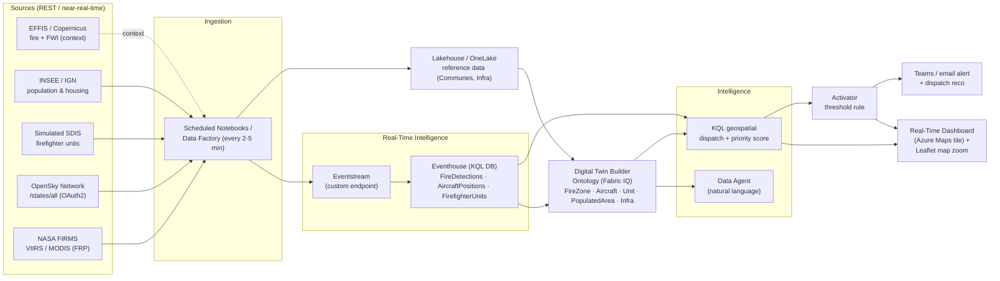

# Fabric Wildfire Response Demo

**Breaking data silos to dispatch wildfire resources in seconds, not meetings.** A Microsoft Fabric end-to-end demo over the French *Sud-Est* that unifies satellite fire detections, aircraft positions, firefighter units and population data into a single ontology, then reasons over it to recommend — and alert on — the right dispatch.

---

## Why

During a wildfire crisis the data that matters lives in four disconnected silos: **where the fires are** (satellites), **where the aircraft are** (transponders), **where the ground crews are** (dispatch systems), and **who and what is at risk** (population and infrastructure registries). Cross-referencing them today is a manual, meeting-driven exercise that costs the one thing a fire does not give back: time.

This demo shows how Fabric collapses those silos into one semantic model (a Digital Twin Builder ontology, a.k.a. **Fabric IQ**), makes it queryable in natural language (a **Data Agent**), scores every fire by real risk (population density, buildings/infrastructure proximity, distance to the nearest available resource), and turns a threshold breach into an automatic **Teams alert with a concrete dispatch recommendation** — while a live map zooms straight to the ignition point.

---

## Architecture



---

## Data sources

| Source | Provides | Nature |
|--------|----------|--------|
| **NASA FIRMS** (VIIRS / MODIS) | Active fire detections with `frp` (Fire Radiative Power), coordinates, acquisition time. BBox France `-5,41,10,51.5`, free `MAP_KEY`. | **Live** — but near-real-time: bound to satellite passes, not continuous (see Disclaimers). |
| **EFFIS / Copernicus** | Active-fire product and the **FWI** danger index — an optional context/credibility layer used to weight priority. | **Live** context layer (optional). |
| **OpenSky Network** (`/states/all`) | Aircraft positions/altitude/velocity by callsign. Sécurité Civile callsigns: `PELICAN`=Canadair CL-415, `MILAN`=Dash-8, `DRAGON`=helicopters. OAuth2 client. | **Live** where transponders are visible; may be sparse/absent → fall back to simulated. |
| **INSEE / IGN** | Population and housing (density, buildings), curated *Sud-Est* subset. | **Reference** data, curated (static for the demo). |
| **Simulated SDIS units** | Firefighter/ground units (`unit_id`, base, status available/engaged). No public real-time API exists. | **Simulated** — generated and clearly labeled. |

---

## Prerequisites

- A **Microsoft Fabric capacity** (F2+ or a trial) with the **Real-Time Intelligence** workload enabled.
- A **FIRMS `MAP_KEY`** — free, from the NASA FIRMS API portal.
- An **OpenSky Network OAuth2 client** (client id + secret) for the aircraft feed.
- An **Azure Maps** account key for the Real-Time Dashboard map tile.
- Permission to create Fabric items: Workspace, Lakehouse, Eventhouse (KQL DB), Eventstream, Digital Twin Builder, Data Agent, Activator, Real-Time Dashboard.
- Optional: **VS Code** with the Fabric/Synapse and Kusto extensions for local authoring (see below).

---

## Repository structure

```
fabric-wildfire-demo/
├── README.md
├── LICENSE
├── .gitignore
├── config/
│   └── parameters.example.json        # copy to parameters.json (git-ignored) and fill your keys
├── notebooks/
│   ├── 01_ingest_firms_fire_detections.ipynb
│   ├── 02_ingest_opensky_aircraft.ipynb
│   ├── 03_simulate_firefighter_units.ipynb
│   └── 04_load_reference_data.ipynb
├── kql/
│   ├── 01_setup_eventhouse.kql         # tables / mappings for hot data
│   ├── 02_dispatch_logic.kql           # geospatial priority + dispatch rule
│   └── 03_activator_source.kql         # query that feeds the Activator rule
├── docs/
│   ├── BUILD_GUIDE.md                  # step-by-step, phases 0 → 7
│   ├── ARCHITECTURE.md                 # medallion, ontology, geospatial, alerting
│   └── DEMO_SCRIPT.md                  # the ~8-minute on-stage walkthrough
└── map/
    ├── index.html                      # companion Leaflet map (zooms to the fire)
    └── sample_snapshot.geojson         # demo data for the map
```

---

## Setup / how to build

Follow **[`docs/BUILD_GUIDE.md`](docs/BUILD_GUIDE.md)** for the full, numbered walkthrough. It is organised in the same phases the demo was built in:

- **Phase 0 — Socle:** capacity, workspace, and the three keys (FIRMS `MAP_KEY`, OpenSky OAuth2, Azure Maps).
- **Phase 1 — Feux:** FIRMS ingestion notebook → Eventhouse; first map.
- **Phase 2 — Avions + référentiels:** OpenSky aircraft + Lakehouse reference data.
- **Phase 3 — Ontologie:** the Digital Twin Builder ontology (Fabric IQ).
- **Phase 4 — Dispatch:** the geospatial KQL priority score and dispatch rule.
- **Phase 5 — Data Agent:** natural-language questions grounded on the ontology/Eventhouse.
- **Phase 6 — Alerting:** Activator rule → Teams alert with dispatch recommendation.
- **Phase 7 — Polish:** Real-Time Dashboard, demo script, and scenarized injection.

Quick start:

1. Copy `config/parameters.example.json` to `config/parameters.json` and fill in your keys (this file is git-ignored — never commit secrets).
2. Create the Fabric workspace, Lakehouse and Eventhouse (BUILD_GUIDE Phase 0–1).
3. Import the notebooks and schedule the ingestion ones every **2–5 minutes**.
4. Run `kql/01_setup_eventhouse.kql`, then wire the Eventstream to the Eventhouse.
5. Build the ontology, the dispatch KQL, the Data Agent, the Activator and the dashboard, phase by phase.

---

## How to develop from VS Code

You can author most of the *code* assets locally and let Fabric’s Git integration sync them into the workspace:

- **Notebooks** — install the **Fabric Data Engineering / Synapse VS Code** extension. It lets you open, edit and run Fabric notebooks against a live Spark session, with local IntelliSense.
- **KQL** — use the **Kusto (Azure Data Explorer)** VS Code extension to write and run `.kql` against the Eventhouse.
- **Code assist** — **GitHub Copilot** works throughout (Python in notebooks, KQL, the Leaflet map JS).
- **Two-way workspace sync** — connect the Fabric workspace to this GitHub repo via **Fabric Git integration**. Notebooks, KQL databases/querysets, the Digital Twin Builder item, Activator and the Real-Time Dashboard are serialized as Git-syncable items, so you edit in VS Code → commit → *Update from Git* in Fabric (and vice-versa).
- **Deployment / CI-CD** — use the **Fabric CLI (`fab`)** and **`fabric-cicd`** (the Python deployment library) to promote items across workspaces (dev → test → prod) from a pipeline.

> Note: **Digital Twin Builder, Activator and the Real-Time Dashboard** are authored in the **Fabric portal** (their designers are visual), but the resulting items remain **Git-syncable** — you version them in this repo even though you don’t hand-edit their JSON.

---

## Disclaimers

- **“Live” does not mean continuous.** FIRMS detections arrive with **satellite passes** (near-real-time), and OpenSky coverage depends on transponder visibility. For a reliable stage demo, use **replay** of a recent window **or a scenarized injection** of a hot fire so the Activator fires on cue.
- **Simulated feeds are labeled.** Firefighter/**SDIS** units have no public real-time API and are **simulated**. Aircraft may also be simulated when the live feed is sparse. Every simulated element is disclosed in the UI and data.
- **Digital Twin Builder is in preview.** The ontology layer (Fabric IQ) is a **preview** capability; behaviour and APIs may change.
- **Not operational.** This is a **demo/sample**. It is not a certified dispatch tool and must not be used for real emergency decisions.

## License

**MIT** — sample/demo code, provided *as-is*, no warranty. See [`LICENSE`](LICENSE).

*Owner: Xavier Perret — GBB Data Platform, France.*
