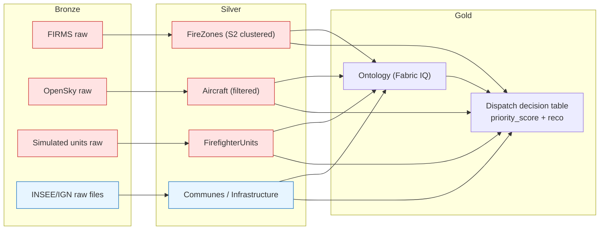
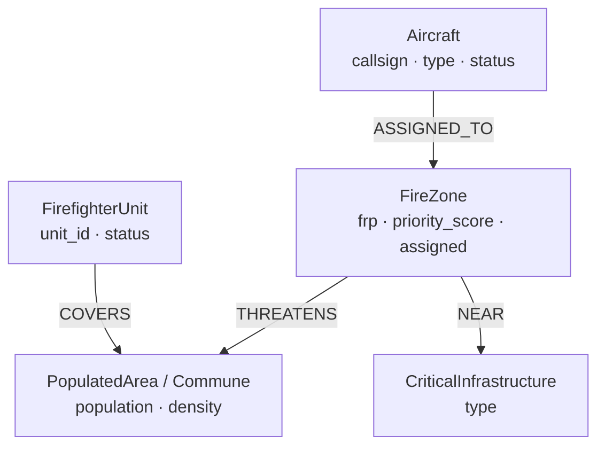
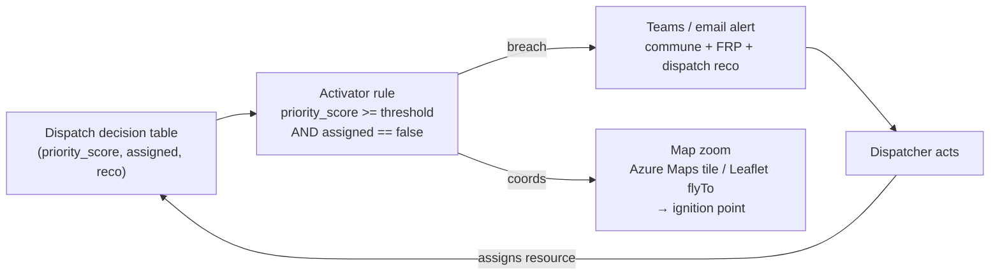

# Architecture — Fabric Wildfire Response Demo

This document goes one level deeper than the README: the medallion layout, why Real-Time Intelligence is used for hot data while OneLake/Lakehouse holds reference data, the ontology entity-relationship model, the geospatial approach in KQL, and the alerting/action loop.

---

## 1. Medallion layout (bronze → silver → gold)

The demo follows a classic **medallion** shape, spread across two Fabric engines because the data has two very different temperatures.

- **Bronze — raw ingestion.** Exactly what the source returned, minimally typed.
  - *Hot:* FIRMS CSV rows, OpenSky `/states/all` vectors, simulated unit rows land as raw records in the **Eventhouse** (via the Eventstream custom endpoint) or as staged files.
  - *Cold:* INSEE/IGN extracts land as raw Delta files in the **Lakehouse**.
- **Silver — cleaned & conformed.** Deduplicated, typed, geospatially normalized.
  - Fire pixels are clustered into **fire zones** (S2 cells) so three VIIRS pixels of one fire become one zone. Aircraft are filtered to Sécurité Civile callsigns. Communes get a clean geometry + density.
- **Gold — semantic / ontology.** The **Digital Twin Builder** ontology projects silver tables into business entities and the relationships between them, and the **dispatch KQL** produces the gold “decision” table (priority score + recommendation) that the dashboard, Data Agent and Activator all consume.



---

## 2. Why Real-Time Intelligence for hot data, Lakehouse for reference

The design deliberately splits the two data temperatures across the right engine:

- **Hot data → Eventstream + Eventhouse (KQL DB).** Fire detections, aircraft positions and unit statuses change **every few minutes** and are queried with **time-window** and **geospatial** semantics. The Eventhouse (Kusto) is built for exactly this: high-ingest streaming, cheap append, and first-class geospatial functions (`geo_*`). The **Eventstream** gives a decoupled **custom endpoint** so notebooks/Data Factory push events without caring who consumes them, and routing to the Eventhouse is configuration, not code. It is also what the **Activator** naturally watches.
- **Reference data → OneLake / Lakehouse.** Communes, population/housing and critical infrastructure are **slow-changing** and relational/tabular. They belong in **Delta** tables in the Lakehouse: cheap to store, easy to join, versioned, and directly consumable by the ontology and by Spark notebooks. Putting static reference data in the streaming store would be wasteful and awkward to update.

The ontology sits **on top of both**, which is the whole point: it lets a query start on a streaming FireZone and reach a Lakehouse Commune in one traversal.

---

## 3. Ontology entity-relationship model (Fabric IQ)

The Digital Twin Builder ontology is the semantic gold layer. It is what makes the four silos *one* model.

**Entities and key properties**

| Entity | Backing source | Key properties |
|--------|----------------|----------------|
| **FireZone** | Eventhouse `FireDetections` (S2-clustered) | id, latitude, longitude, `frp`, first_seen, last_seen, `priority_score`, `assigned` |
| **Aircraft** | Eventhouse `AircraftPositions` | callsign, type (Canadair CL-415 / Dash-8 / helicopter), latitude, longitude, altitude, status |
| **FirefighterUnit** | Eventhouse `FirefighterUnits` (simulated) | unit_id, base, latitude, longitude, status (available/engaged) |
| **PopulatedArea / Commune** | Lakehouse `Communes` (INSEE/IGN) | insee_code, name, population, housing_density, geometry |
| **CriticalInfrastructure** | Lakehouse `CriticalInfrastructure` | id, type, latitude, longitude |

**Relationships**

| From | Relationship | To | Backed by |
|------|--------------|----|-----------|
| FireZone | **THREATENS** | PopulatedArea | geospatial: fire within/near commune polygon + density |
| Aircraft | **ASSIGNED_TO** | FireZone | dispatch assignment |
| FirefighterUnit | **COVERS** | Commune | coverage area of the unit’s base |
| FireZone | **NEAR** | CriticalInfrastructure | geospatial: `geo_distance_2points` under a radius |



A single question like *“which fires threaten a populated area with no resource assigned?”* becomes a traversal: `FireZone —THREATENS→ PopulatedArea` filtered by `assigned == false` and the absence of an `ASSIGNED_TO`/`COVERS` resource — which is precisely what the Data Agent walks.

---

## 4. Geospatial approach in KQL

All spatial reasoning lives in the Eventhouse using Kusto’s `geo_*` functions:

- **Clustering with S2 cells — `geo_point_to_s2cell()`.** Raw FIRMS pixels are hashed into **S2 cells** at a chosen level. Detections sharing a cell (and time window) collapse into one **FireZone**, so the map shows fires, not pixel noise. S2 cells are also a fast pre-filter (“same neighbourhood”) before exact distance math.
- **Nearest resource — `geo_distance_2points()`.** Geodesic (great-circle) distance in metres between a fire and every candidate aircraft/unit yields the **nearest available** resource, and fire-to-water distance feeds aircraft suitability (Canadairs need a scoopable water body).
- **Exposure — `geo_point_in_polygon()`.** Tests whether a fire lies inside a commune / urban polygon to quantify **population exposure** and drive the `THREATENS` relationship.

**Priority score.** Combining the above:

```
priority_score = f( FRP,
                    population density within 5 km,
                    proximity of buildings / critical infrastructure,
                    − distance to nearest available resource )
```

Hotter fires (`frp`), denser surroundings and closer structures push the score up; a nearby *available* resource that isn’t yet assigned also raises urgency. Optionally, a high **FWI** (EFFIS) further weights it.

**Dispatch rule (decision layer).**
- **large / remote / near water →** aircraft (Canadair/Dash-8).
- **near housing / structural →** ground **SDIS**.
- **high FWI + dense + unassigned →** combined air + ground **and** maximum priority.

---

## 5. Alerting / action loop

The gold decision table is not just displayed — it drives an automated loop.



1. The **Activator** continuously evaluates the `03_activator_source.kql` output.
2. When a zone crosses the **threshold while unassigned**, it emits **one** alert (deduped per zone) to **Teams/email** containing the threatened commune, the FRP/priority and the **dispatch recommendation** (e.g. *“PELICAN 32 + SDIS 83”*).
3. The same event carries the fire’s **coordinates**, which recenter the **Azure Maps** dashboard tile — and, for the tenant-independent version, the **Leaflet** companion map `flyTo`s the ignition point.
4. A dispatcher assigns a resource; `assigned` flips true, the score drops, and the loop closes — no more alert for that zone.

This is the demo’s thesis in one diagram: **decompartmentalisation → dispatch in seconds**, with a human in the loop but the cross-silo reasoning done for them.
